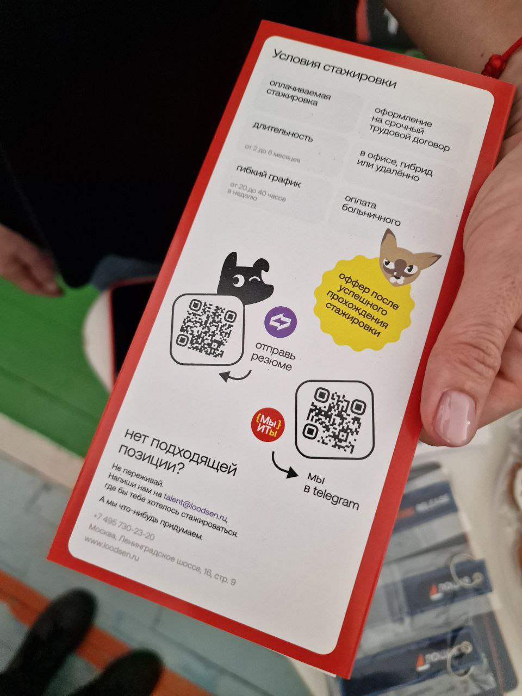
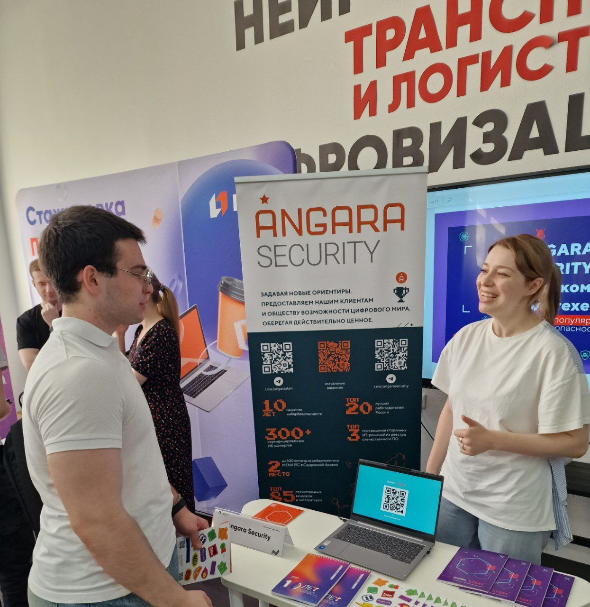
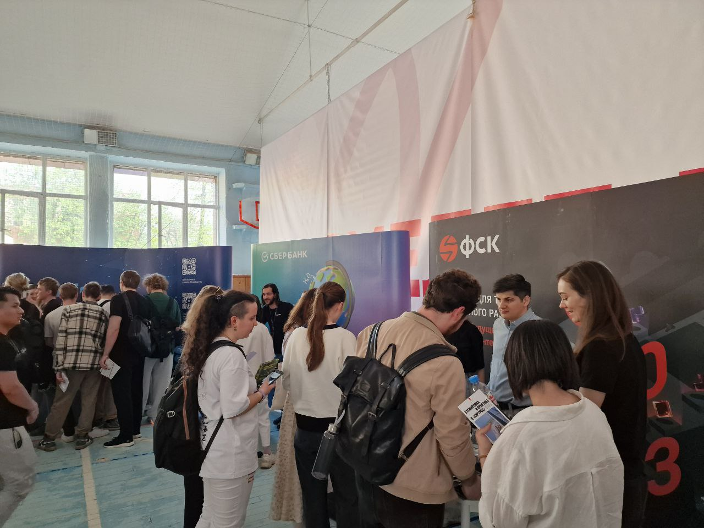
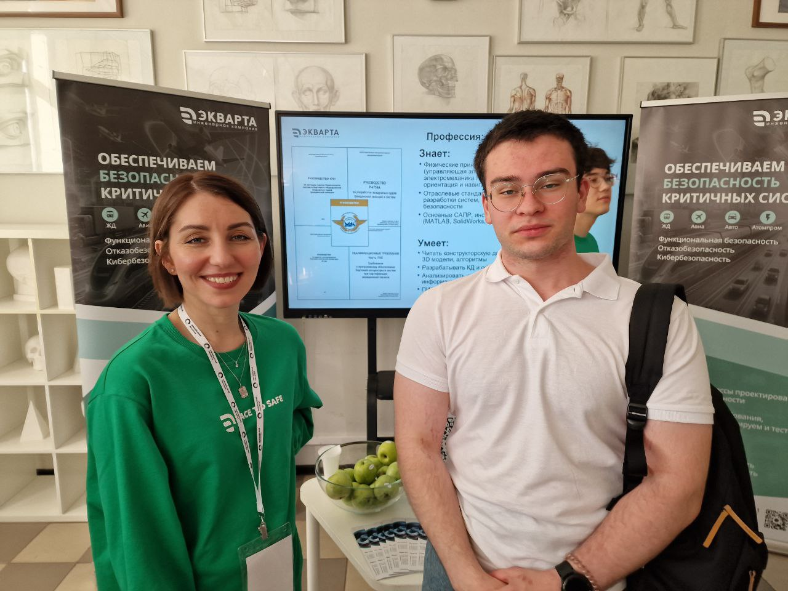
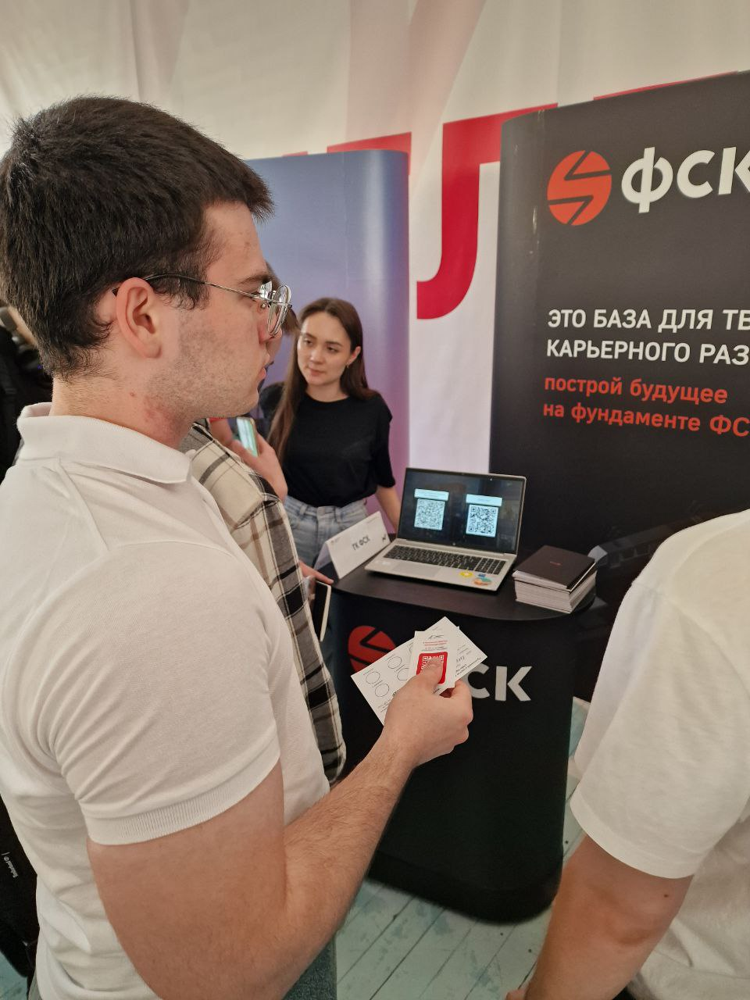
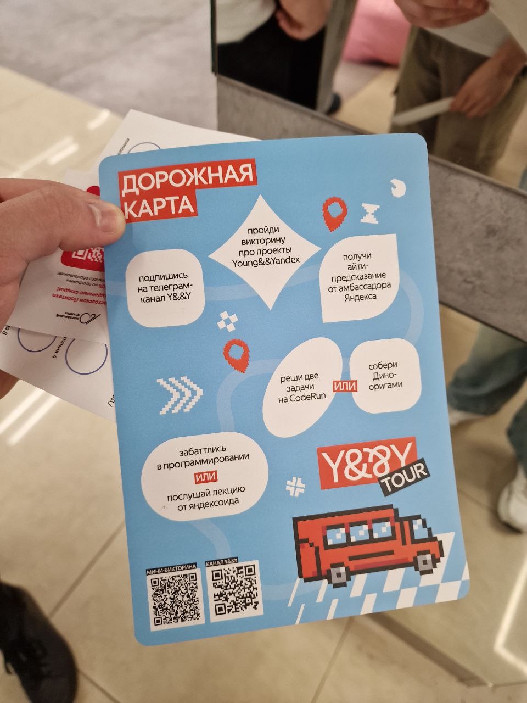

# Отчёт о посещении карьерного марафона в Московском Политехе

## Дата события
22 апреля 2025 года

## Описание мероприятия
22 апреля 2025 года я посетил карьерный марафон, проводимый в Московском Политехе. Это событие собрало множество компаний и их представителей, что позволило не только узнать о новых возможностях в карьерной сфере, но и пообщаться с партнерами и экспертами. 

## Опыт и полученные знания
Во время марафона я смог узнать о различных трендах в сфере технологий и науки, а также о том, как компании ищут таланты и какие требования предъявляют к кандидатам. Я общался с представителями компаний, которые интересуются теми же направлениями, что и я, и это дало мне новые идеи для дальнейшего развития. Я также получил полезные советы по поиску работы и карьерному росту, а также узнал о новых инструментах и методах, которые могут быть полезны в моем профессиональном пути.

### Связь с проектом
Знания, полученные на карьерном марафоне, прямо связаны с моим текущим проектом **"Робобол"** — сайт для инновационной физической игры с образовательными элементами. Обсуждения о новых технологиях в программировании и образовании, особенно в контексте создания интерактивных и образовательных платформ, помогли мне расширить кругозор и лучше понять текущие тренды в области детского образования через игровые технологии.
## Фото с мероприятия
<table>
  <tr>
    <td></td>
    <td></td>
    <td></td>
  </tr>
  <tr>
    <td></td>
    <td></td>
    <td></td>
  </tr>
</table>

## Заключение
Посещение карьерного марафона в Московском Политехе было полезным и вдохновляющим опытом. Я получил новые знания и идеи, которые будут способствовать развитию моей карьеры в будущем.